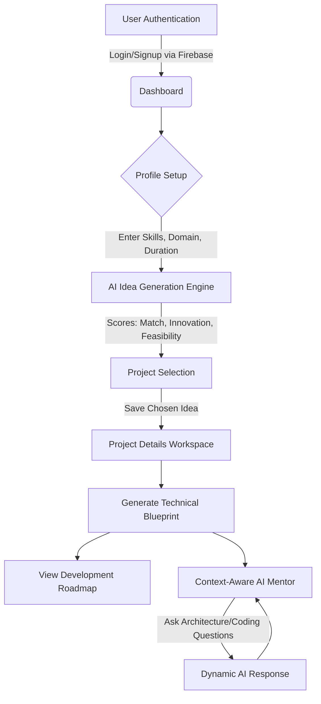
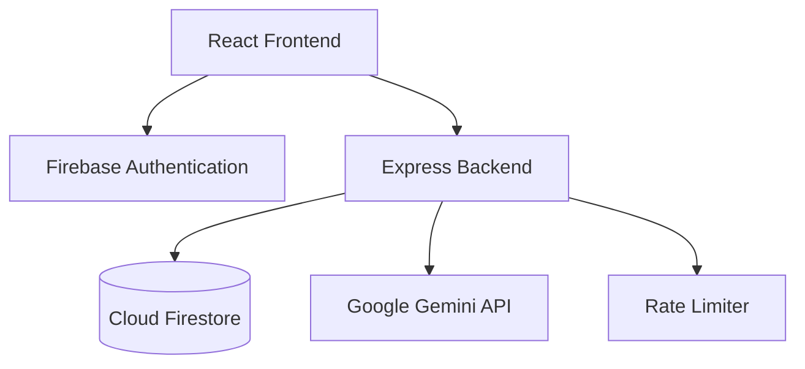

# AYROJECT AI

From Student Skills to a Practical Final-Year Project

## Overview

AYROJECT AI is an advanced, AI-powered platform designed to mentor final-year students from their initial skill assessment all the way to a fully-architected final-year project blueprint. It resolves the common issue of students selecting overly complex or under-scoped projects by grounding ideas in real constraints and providing a clear, actionable roadmap.

## Problem Statement

Final-year students often struggle to generate practical project ideas that align with their current technical skills, career goals, and the limited timeframe of an academic semester. They need guidance on architectural decisions, feature scoping, and development roadmaps.

## Solution

AYROJECT AI bridges this gap by acting as a personalized technical mentor. It takes a student's profile (skills, proficiency, interests, timeframe) and uses server-side Gemini AI reasoning to construct feasible project concepts. Once a concept is selected, it generates a complete blueprint (MVP features, database schema, architecture) and an adaptive weekly roadmap. A context-aware AI mentor is available to answer questions specific to the generated blueprint.

## Key Features

*   **Deterministic Idea Generation**: Controlled AI generation mapping student skills to feasible projects.
*   **Project Blueprinting**: Architectural, DB, and tech-stack synthesis tailored for student MVPs.
*   **Adaptive Roadmapping**: Week-by-week structured planning based on the chosen project duration.
*   **Context-Aware AI Mentor**: A focused AI assistant pre-loaded with the specific student and project context.
*   **Comparison Engine**: Data-driven metrics for skill matching, feasibility, and innovation.

---

## 🔄 User Workflow & Application Flowchart

The application follows a structured, sequential workflow to guide students from ideation to development:



### Step-by-Step Workflow:
1. **Authentication:** Secure entry via Firebase Auth.
2. **Profile Generation:** Input academic details, skills, and duration.
3. **Idea Comparison:** Compare 3-5 distinct project ideas and select the most feasible.
4. **Blueprint Generation:** Expand the selected idea into a detailed tech spec.
5. **Mentorship & Execution:** Follow the roadmap and consult the AI Mentor for technical hurdles.

---

## 🏗️ System Architecture



### AI Architecture Details
*   **Server-Side Only**: All `@google/genai` interactions are handled securely on the backend.
*   **Controlled Generation**: Strict prompt templates using JSON schemas enforce deterministic, machine-readable output.
*   **Context Injection**: The AI Mentor endpoint dynamically injects the student's profile and previously generated blueprint to maintain strict relevance and avoid generic chatbot behavior.
*   **Resilient Fallbacks**: Backend wraps model calls (`gemini-3.6-flash`, `gemini-3.1-flash-lite`) in a fallback chain to ensure high availability.

---

## 🛠️ Technology Stack

*   **Frontend:** React 18, Vite, Tailwind CSS, React Router, Lucide React
*   **Backend:** Node.js, Express
*   **AI Engine:** Google Gen AI SDK (`@google/genai`), Gemini 3.6 Flash / 3.1 Flash Lite
*   **Database & Auth:** Google Cloud Firebase (Firestore, Authentication, Admin SDK)

---

## 🔒 Security & Deployment Configuration

This application is built to be deployed securely on **Google Cloud Run**. Follow these steps to configure your environment, deploy the app, and secure your database.

### 1. Firestore Security Rules
To ensure strict User Data Isolation (IDOR prevention), deploy these rules to your Firebase project to guarantee users can only read and write their own data:

```javascript
rules_version = '2';
service cloud.firestore {
  match /databases/{database}/documents {
    match /users/{userId} {
      allow read, write: if request.auth != null && request.auth.uid == userId;
      
      match /projects/{projectId} {
        allow read, write: if request.auth != null && request.auth.uid == userId;
        
        match /mentorMessages/{messageId} {
          allow read, write: if request.auth != null && request.auth.uid == userId;
        }
      }
    }
  }
}
```

### 2. Secret Manager Setup
You must securely store your Gemini API key using Google Cloud Secret Manager instead of hardcoding it in the codebase.

```bash
# Create and populate the secret in your GCP project
gcloud secrets create GEMINI_API_KEY --replication-policy="automatic"
echo -n "YOUR_GEMINI_API_KEY" | gcloud secrets versions add GEMINI_API_KEY --data-file=-

# Grant your Cloud Run default compute service account access to read the secret
gcloud secrets add-iam-policy-binding GEMINI_API_KEY \
  --member="serviceAccount:YOUR_PROJECT_NUMBER-compute@developer.gserviceaccount.com" \
  --role="roles/secretmanager.secretAccessor"
```

### 3. Google Cloud Run Deployment Flow
Once your environment variables and secrets are configured, build and deploy the containerized application.

```bash
# Deploy the application to Cloud Run
gcloud run deploy ayroject-ai-service \
  --source . \
  --region us-central1 \
  --allow-unauthenticated \
  --set-secrets="GEMINI_API_KEY=GEMINI_API_KEY:latest"
```

### 4. Required Campaign Labeling (Verification)
To register this service for automated challenge verification, apply the mandatory resource label:

```bash
gcloud run services update ayroject-ai-service \
  --update-labels=dev-tutorial=cloud-run-ai-challenge \
  --region=us-central1
```
