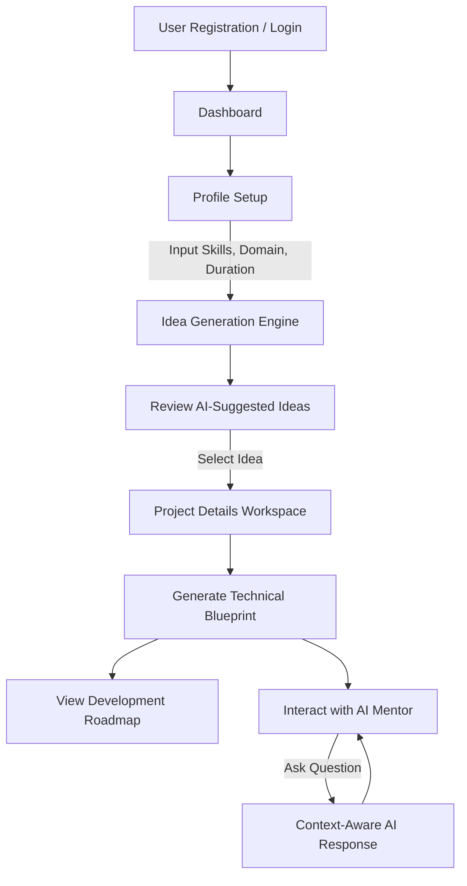

# AYROJECT AI - AI-Powered Student Project Architect & Mentor

AYROJECT AI is a full-stack, AI-driven platform designed to help software engineering students ideate, architect, and build their final-year projects. By deeply analyzing a student's skills, it generates tailored project ideas, crafts comprehensive architectural blueprints, and provides an interactive AI mentor to guide them through the development process.

## 🚀 Key Features & Functionality

1. **AI Project Ideation:** Analyzes the student's tech stack and interests to generate highly relevant, innovative, and feasible project ideas.
2. **Automated Technical Blueprints:** Generates a complete MVP scope, system architecture, database design, and technology stack recommendations for the chosen idea.
3. **Week-by-Week Roadmap:** Automatically creates a structured, structured week-by-week development plan with clear deliverables and estimated effort.
4. **Context-Aware AI Mentor:** A specialized chatbot that understands the specific blueprint and roadmap, answering the student's technical queries securely and accurately.
5. **Real-time Persistence:** Saves all generated ideas, roadmaps, and mentor chat histories securely to the cloud.

---

## 🔄 User Workflow & Application Flowchart

Here is the step-by-step flow of how a user interacts with AYROJECT AI:



### Flow Breakdown:
* **Step 1:** User logs in securely via Firebase Authentication.
* **Step 2:** User inputs their current skills, preferred domain (e.g., AI, Web, Mobile), and project duration.
* **Step 3:** The Gemini AI generates multiple viable project proposals, complete with innovation and feasibility scores.
* **Step 4:** Upon selecting a project, the user triggers the **Blueprint Generator**.
* **Step 5:** The backend orchestrates a structured JSON prompt to Gemini to map out the system architecture and a weekly schedule.
* **Step 6:** As the student builds the project, they interact with the **AI Mentor**, which dynamically retrieves their specific project blueprint to provide highly customized coding and architectural advice.

---

## 🛠️ Technology Stack

**Frontend Framework & Libraries:**
* **React 18** (UI components and state management)
* **Vite** (Next-generation frontend tooling and bundling)
* **Tailwind CSS** (Utility-first styling framework for responsive design)
* **React Router DOM** (Client-side routing)
* **Lucide React** (Consistent, modern iconography)

**Backend & AI Infrastructure:**
* **Node.js & Express** (Custom API proxy and robust server-side routing)
* **Google Gen AI SDK (`@google/genai`)** (Powering ideation, blueprints, and the mentor chat)
* **Gemini Models** (Utilizing `gemini-3.6-flash` and `gemini-3.1-flash-lite` for complex reasoning and fallback generation)

**Database & Authentication (Google Cloud / Firebase):**
* **Firebase Authentication** (Secure user session management)
* **Cloud Firestore** (NoSQL document database for persisting profiles, projects, and chat history)
* **Firebase Admin SDK** (Secure server-side validation and database interactions)

---

## 🔒 Security & Deployment Configuration

This application is built to be deployed securely on **Google Cloud Run**. Follow these steps to configure your environment, deploy the app, and secure your database.

### 1. Firestore Security Rules
To ensure strict User Data Isolation (IDOR prevention), deploy these rules to your Firebase project to guarantee users can only read and write their own data:

```javascript
rules_version = '2';
service cloud.firestore {
  match /databases/{database}/documents {
    match /users/{userId} {
      // Users can only access and edit their own root profile document
      allow read, write: if request.auth != null && request.auth.uid == userId;
      
      // Users can only access their own nested projects and mentor chats
      match /projects/{projectId} {
        allow read, write: if request.auth != null && request.auth.uid == userId;
        
        match /mentorMessages/{messageId} {
          allow read, write: if request.auth != null && request.auth.uid == userId;
        }
      }
    }
  }
}
```

### 2. Secret Manager Integration
You must securely store your Gemini API key using Google Cloud Secret Manager instead of hardcoding it in the codebase.

```bash
# Create and populate the secret in your GCP project
gcloud secrets create GEMINI_API_KEY --replication-policy="automatic"
echo -n "YOUR_GEMINI_API_KEY" | gcloud secrets versions add GEMINI_API_KEY --data-file=-

# Grant your Cloud Run default compute service account access to read the secret
gcloud secrets add-iam-policy-binding GEMINI_API_KEY \
  --member="serviceAccount:YOUR_PROJECT_NUMBER-compute@developer.gserviceaccount.com" \
  --role="roles/secretmanager.secretAccessor"
```

### 3. Google Cloud Run Deployment
Once your environment variables and secrets are configured, build and deploy the containerized application.

```bash
# Deploy the application to Cloud Run
gcloud run deploy ayroject-ai-service \
  --source . \
  --region us-central1 \
  --allow-unauthenticated \
  --set-secrets="GEMINI_API_KEY=GEMINI_API_KEY:latest"
```

### 4. Required Campaign Labeling (Verification)
To register this service for automated challenge verification, apply the mandatory resource label:

```bash
gcloud run services update ayroject-ai-service \
  --update-labels=dev-tutorial=cloud-run-ai-challenge \
  --region=us-central1
```
